# Job Portal Application (ApplAI)  — Full Stack

This is a job portal application that supports complete user flows for Candidates, Recruiters, and Hiring Managers. The system includes a Vue-based frontend and a Flask-based backend, both working together as a complete full-stack solution.

---

## 🛠️ Tech Stack

### Frontend
| Technology     | Purpose                                  |
| -------------- | ---------------------------------------- |
| **Vue 3**      | Main frontend framework                  |
| **Vue Router** | Handles page navigation                  |
| **Vuex**       | Global state management                  |
| **Vite**       | Project scaffolding & development server |


### Backend
| Technology            | Purpose                      |
| --------------------- | ---------------------------- |
| **Flask**             | Backend framework            |
| **SQLAlchemy**        | ORM for database operations  |
| **JWT**               | Token-based auth for APIs    |
| **Flask-Login**       | Authentication handler       |
| **Werkzeug**          | Security + file uploads      |
| **Google Gemini API** | AI job description generator |
| **Redis (optional)**  | Caching layer                |


---

## 🧭 Frontend Routes Overview

The project uses **Vue Router** for client-side navigation.  
Below is a complete list of routes and their corresponding components.

| **Path**             | **Component**               | **Description**                                    |
| -------------------- | --------------------------- | -------------------------------------------------- |
| `/`                  | `HomeView.vue`              | Landing page                                       |
| `/login`             | `LogIn.vue`                 | Login page                                         |
| `/signup`            | `SignUp.vue`                | Register new user                                  |
| `/about`             | `About.vue`                 | About the platform                                 |
| `/contact`           | `Contact.vue`               | Contact & support                                  |
| `/jobs`              | `JobListing.vue`            | All job listings                                   |
| `/recruiter`         | `RecruiterDashboard.vue`    | Main recruiter dashboard                           |
| `/recruiter/profile` | `RecruiterProfile.vue`      | Update recruiter details                           |
| `/recruiter/tracker` | `SmartCandidateTracker.vue` | Applicant tracking system (ATS) & Kanban view      |
| `/candidate`         | `CandidateDashboard.vue`    | Candidate dashboard                                |
| `/candidate/profile` | `CandidateProfile.vue`      | Update candidate details                           |
| `/candidate/saved`   | `SavedJobs.vue`             | Saved Job by candidate                             |
| `/candidate/applied` | `AppliedJobs.vue`           | Candidate track status for submitted applications  |

---

## 🧪 API Endpoints Overview

### 🔐 Authentication
| Method | Endpoint | Description |
|--------|----------|-------------|
| POST | `/api/login` | Login (JWT) |
| POST | `/api/logout` | Logout |

### 👤 Candidate
| Method | Endpoint | Description |
| :--- | :--- | :--- |
| **POST** | `/api/register-candidate` | Register (Requires form data + resume upload) |
| **POST** | `/api/update-candidate` | Update profile (optional new resume upload) |
| **GET** | `/api/applied-jobs` | Get all applied jobs and status for the candidate |
| **POST** | `/api/save-job` | Save a job to the candidate's list |
| **DELETE** | `/api/save-job/<int:job_id>` | Remove a job from saved list |
| **GET** | `/api/saved-jobs-details` | Get the details of all saved jobs |
| **GET** | `/api/resume-status` | Get asynchronous resume parsing status (PENDING/SUCCESS/FAILED) |
| **POST** | `/api/resume-retry` | Restart resume parsing task |
| **POST** | `/api/job-apply` | Apply for a job (requires test score in DB) |

### 🧑‍💼 Recruiter
| Method | Endpoint | Description |
| :--- | :--- | :--- |
| **POST** | `/api/register-recruiter` | Register a new recruiter |
| **POST** | `/api/update-recruiter` | Update recruiter profile |
| **GET** | `/api/jobs-all` | Get all active jobs (for public/candidate listings) |
| **GET** | `/api/jobs` | Get jobs created **by the current recruiter** |
| **POST** | `/api/job` | Create new job (can auto-generate description via Gemini) |
| **PUT** | `/api/job/<int:job_id>` | Update job details |
| **DELETE** | `/api/job/<int:job_id>` | Delete job |
| **GET** | `/api/recruiter/jobs` | Get recruiter's jobs with applicant statistics |
| **GET** | `/api/recruiter/stats` | Get recruiter's overall dashboard statistics |
| **GET** | `/api/recruiter/applications-paged` | Get paginated application list for a specific `job_id` |
| **GET** | `/api/candidate-job-requests` | Get all applications for all jobs created by the recruiter (legacy/flat) |
| **PUT** | `/api/candidate-job-request/<int:request_id>` | Update application status (e.g., to SHORTLISTED) or set interview time |
| **POST** | `/api/schedule-interview/<int:cjr_id>` | Schedules interview, creates Google Meet link, and updates status to `INTERVIEW_SCHEDULED` |

### 🤖 AI (Chatbot & Test)
| Method | Endpoint | Description |
| :--- | :--- | :--- |
| **POST** | `/api/chatbot/response` | Get a chatbot reply based on job context (powered by Gemini) |
| **GET** | `/api/chatbot/history/<int:job_id>` | Fetch conversation history for a job |
| **POST** | `/api/chatbot/clear` | Clear conversation history |
| **GET** | `/api/credibility-test/<int:job_id>` | Generate and retrieve the 10-question credibility test (MCQ) |
| **POST** | `/api/credibility-test/<int:job_id>` | Submit test score. Automatically updates application status to **APPLIED**. |

### 📅 Google Calendar (Interview Scheduling Helpers)
| Method | Endpoint | Description |
| :--- | :--- | :--- |
| **GET** | `/api/google-oauth-url` | Get URL to start the Google Calendar authorization process |
| **GET** | `/api/google-oauth-callback` | Google redirect endpoint (handles code exchange with frontend script) |
| **POST** | `/api/google-exchange-code` | Exchange OAuth code for tokens and save them to the Recruiter's profile |
| **GET** | `/api/google-status` | Check if the Recruiter's Google account is connected |
| **POST** | `/api/google-create-event` | Low-level endpoint to manually create an event using a token |

---

## 🏗️ Architecture Diagrams

### 1. High-Level System Architecture


### 2. Resume Parsing Flow


### 3. Interview Scheduling with Google Calendar


### 4. AI Chatbot Architecture


### 5. Job Application + Credibility Test Flow

```mermaid
flowchart TD

    A[Candidate opens job] --> B[GET /api/credibility-test/<job_id>]
    B --> C[Gemini generates 10 MCQs]
    C --> D[Frontend displays questions]

    D --> E[POST /api/credibility-test/<job_id>]
    E --> F[Save score + status TEST_COMPLETED]
    F --> G[Auto-apply → status APPLIED]
    G --> H[Candidate sees application in dashboard]
```



---

## 📁 Project Structure (Frontend)

```
frontend/
├── public/
│   └── images/
│       └── team/
│           ├── Anushka.jpg
│           ├── Deval.jpg
│           ├── Mangesh.jpg
│           ├── Prasoon.jpg
│           ├── Praul.jpg
│           ├── Shyaam.jpg
│           ├── Suvrat.jpg
│           ├── Tripurari.jpg
│           └── young-businesswomen-working-with-digital-tablet-her-office.jpg
│
├── src/
│   ├── assets/
│   ├── components/
│   │   ├── CandidateNavbar.vue
│   │   ├── ApplicantsModal.vue
│   │   ├── ChatBot.vue
│   │   ├── Footer.vue
│   │   ├── JobManagement.vue
│   │   ├── JobCard.vue
│   │   ├── JobDetailsModal.vue
│   │   ├── Navbar.vue
│   │   └── RecruiterNavbar.vue
│   │
│   ├── router/
│   │   └── index.js
│   │
│   ├── services/
|   |   ├── api.js
│   │   └── auth.js
│   │
│   ├── views/
│   │   ├── About.vue
│   │   ├── AppliedJobs.vue
│   │   ├── CandidateDashboard.vue
│   │   ├── CandidateProfile.vue
│   │   ├── Contact.vue
│   │   ├── HomeView.vue
│   │   ├── JobListing.vue
│   │   ├── LogIn.vue
│   │   ├── RecruiterDashboard.vue
│   │   ├── RecruiterProfile.vue
│   │   ├── SavedJobs.vue
│   │   ├── SchedulingModal.vue
│   │   ├── SignUp.vue
│   │   └── SmartCandidateTracker.vue
│   │
│   ├── App.vue
│   └── main.js
│
├── index.html
├── jsconfig.json
├── package.json
├── package-lock.json
├── vite.config.js
├── .gitignore
└── README.md
```

---

## 📁 Project Structure (Backend)

```
backend/
│
├── app/
│   ├── __init__.py
│   ├── models.py
│   ├── routes.py
│   ├── forms.py
│   ├── tasks.py
│   ├── utils.py
│   └── celery_app.py
│
├── config.py
├── requirements.txt
├── Team 14_APIs_YAMLfile.yaml
├── README.md
└── run.py
```

---

## 🚀 Getting Started

Follow these steps to set up and run the project locally.

### 1. Clone the Repository
```bash
git clone https://github.com/21f1001963/soft-engg-project-sep-2025-se-SEP-14.git
```

### 2. Navigate to the Frontend Directory

```bash
cd frontend
```

### 3. Install Dependencies

```bash
npm install
```

### 4. Run Frontend
```bash
npm run dev
```

### 5. Create and activate virtual environment
```bash
cd backend
python -m venv venv
venv\Scripts\Activate  (Windows)
source venv/bin/activate (Linux/Mac)
```

### 6. Install dependencies
```bash
pip install -r requirements.txt
```

### 7. Google OAuth & Calendar Setup for Beginners 📅

The application supports interview scheduling and Google Meet link creation, requiring a Recruiter to authorize access to their Google Calendar via **OAuth 2.0**.

1.  Go to the **Google Cloud Console**.
2.  **Create a new project**.
3.  Navigate to **APIs & Services** > **Enabled APIs & Services**.
4.  Click **+ ENABLE APIS AND SERVICES** and enable the **Google Calendar API**.
5.  Go to **APIs & Services** > **OAuth consent screen**.
    * Set the **User Type** to **External** and proceed.
    * Add the required **scope**: `.../auth/calendar.events`.
    * For testing, add your own email as a **Test User**.
6.  Go to **APIs & Services** > **Credentials**.
    * Click **+ CREATE CREDENTIALS** and select **OAuth client ID**.
    * **Application type**: Select **Web application**.
    * **Name**: Choose a name (e.g., `Flask-Recruiter-App`).
    * **Authorized JavaScript origins**: Add `http://localhost:5173` (your Frontend URL).
    * **Authorized redirect URIs**: Add your full backend redirect endpoint: `http://127.0.0.1:5000/api/google-oauth-callback`.
7.  Click **CREATE** and note down the **Client ID** and **Client Secret**.

### 8. Add Environment Variables  
Update your `backend/.env` file with the following values:

```bash
GOOGLE_API_KEY=your_key
GOOGLE_CLIENT_ID=your_client_id
GOOGLE_CLIENT_SECRET=your_client_secret
GOOGLE_REDIRECT_URI=http://localhost:5000/api/google-oauth-callback
```

### 9. Initialize Database
```bash
flask db init
flask db migrate -m "initial db"
flask db upgrade
```

### 10. Run Backend
```bash
python run.py
```

### 11. Run Celery Server
```bash
celery -A app.celery_app.celery worker --loglevel=info --pool=solo
```

Server runs at:
```bash
http://localhost:5173/  (Frontend)
http://127.0.0.1:5000   (Backend)
```